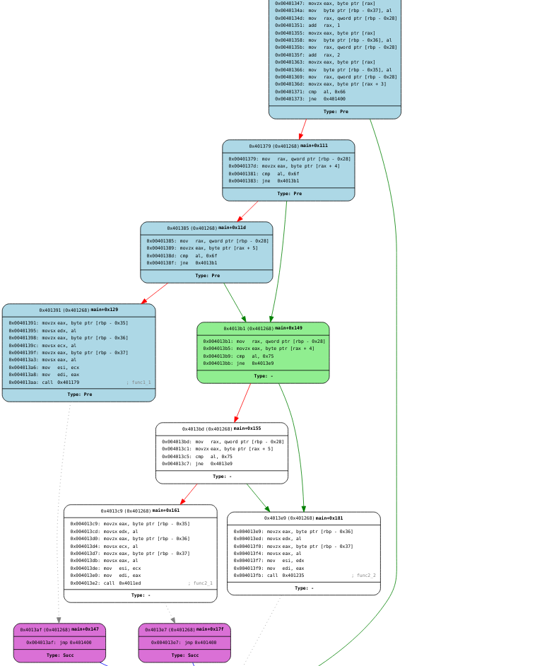

# afl-cov

trimAFL CFG visualization 

The utility is based on [angr](https://github.com/angr/angr), [tracer](https://github.com/angr/tracer), [shellphish-qemu](https://github.com/shellphish/shellphish-qemu), [bingraphvis](http://github.com/axt/bingraphvis/) and [cfg-explorer](http://github.com/axt/cfg-explorer/).

## Note

This project is in its very early stage!

## Usage
```
# Rewrite binary
$ python -m trimaflcov -r /your/binary target

# Visualize binary
$ python -m trimaflcov /your/binary target
```

## Screenshots




